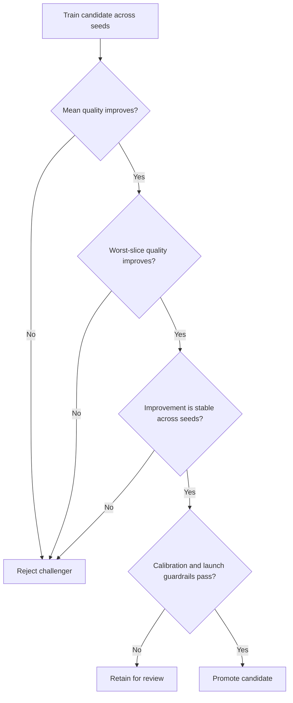

# Architecture

## Purpose

The framework evaluates whether an AI/ML candidate is sufficiently reliable to replace an existing model. It separates model development from checkpoint selection, framework-level model selection, final test evaluation, and launch governance.

## End-to-end flow

```mermaid
flowchart LR
    A[Public or synthetic input data] --> B[Schema and data-quality validation]
    B --> C[Leakage-safe split construction]
    C --> D[Feature and label policy]
    D --> E1[Logistic baseline]
    D --> E2[Tree baseline]
    D --> E3[Transformer candidate]
    E1 --> F[Calibration and uncertainty]
    E2 --> F
    E3 --> F
    F --> G[Selection metrics]
    G --> H[Worst-slice and subgroup checks]
    H --> I[Multi-seed stability]
    I --> J[Champion and challenger decision]
    J --> K[Final held-out test evaluation]
    K --> L[Drift and stress scenarios]
    L --> M[Launch gate and human review]
    M --> N[Reports, provenance, and audit artifacts]
```

## Split semantics

| Stage | Permitted use |
|---|---|
| Train | Parameter fitting |
| Calibration | Calibration and Transformer checkpoint selection |
| Selection | Framework-level champion/challenger selection |
| Test | One-time final evaluation only |

The test split is not used for checkpoint selection, framework selection, threshold tuning, or reselection.

## Model-decision protocol

## Current decision

The current evidence retains the unweighted Transformer candidate, keeps the calibrated TF-IDF logistic model as fallback, rejects the class-weighted challenger, and records launch state as `REVIEW`.

See:

- [Final model decision](FINAL_MODEL_DECISION.md)
- [Experimental evidence](EXPERIMENTAL_EVIDENCE.md)
- [Reproducibility](REPRODUCIBILITY.md)
- [Selection, test, and launch semantics](SELECTION_TEST_LAUNCH_SEMANTICS.md)
- [Claim boundaries](CLAIM_BOUNDARIES.md)

## Runtime profiles

- **GitHub/CPU path:** linting, unit tests, release-contract validation, and small deterministic checks.
- **Local GPU path:** Transformer training, multi-seed stability, weighted challenger evaluation, and full artifact generation.
- **Public repository:** source code, configuration, compact evidence, documentation, and tests.
- **Excluded local state:** raw datasets, caches, checkpoints, experiment runs, and large generated outputs.
